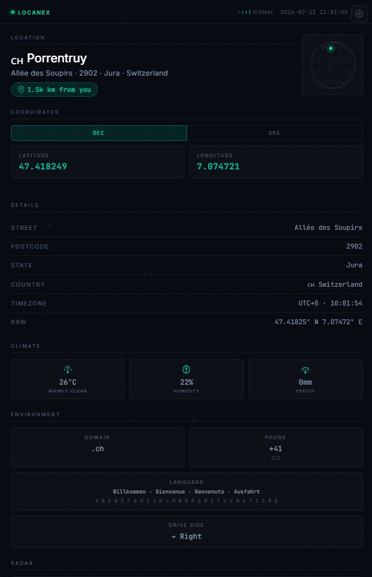
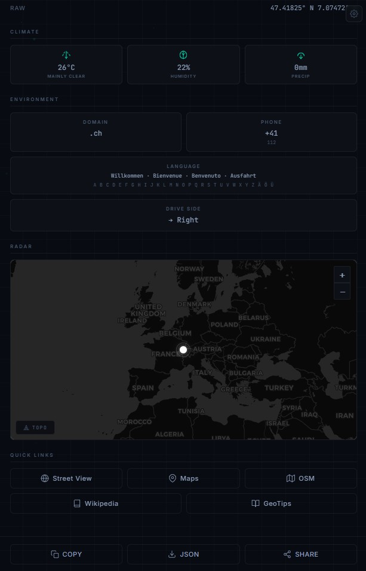
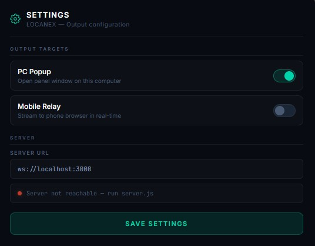
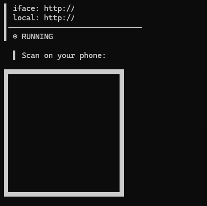

# LOCANEX

GeoGuessr cheat extension — sniffs game API responses and dumps coordinates, map, weather, and country intel into a dark overlay. Works on PC and mobile.

[](LICENSE)

---

## What it does

When you play GeoGuessr, LOCANEX automatically:

- **Intercepts coordinates** from the game API
- **Shows a map** with your location pinned
- **Displays city, country, weather, timezone**
- **Provides local info** — driving side, phone codes, emergency numbers, alphabet, common phrases
- **Works on your phone** via WebSocket relay — scan a QR code and get the overlay on any device

## How it works

1. Install the Chrome extension
2. Open GeoGuessr — LOCANEX activates automatically
3. A dark popup appears with coordinates, map, and all location data
4. Optionally: start the relay server, scan the QR code, and get the overlay on your phone

## Features

- **Live coordinates** — decimal and DMS formats, one-click copy
- **Interactive map** — dark CARTO tiles with terrain overlay toggle
- **Country data** — population, driving side, calling code, TLD
- **Local knowledge** — emergency numbers, alphabet, common phrases in local language
- **Weather** — current temperature and conditions from Open-Meteo
- **Wikipedia** — direct link to city/country article
- **Location history** — last 5 locations saved
- **Export** — download coordinates as JSON
- **Mobile relay** — stream overlay to any phone on your network
- **Auto-switching** — popup hides when phone connects, reappears when it disconnects

---

## Screenshots

<table>
  <tr>
    <td></td>
    <td></td>
  </tr>
  <tr>
    <td colspan="2" align="center"></td>
  </tr>
</table>

### Mobile relay

<table>
  <tr>
    <td align="center"></td>
    <td>Scan the QR code from the terminal or extension Settings to connect your phone. The overlay streams in real-time via WebSocket.</td>
  </tr>
</table>

---

## Installation

### Chrome Extension (manual)

1. Open `chrome://extensions`
2. Enable **Developer mode**
3. Click **Load unpacked**
4. Select the `locanex` folder

### Relay Server (optional, for mobile)

```bash
npm install
node server.js
```

Scan the QR code shown in the terminal or in extension Settings.

---

## Requirements

- Chrome/Chromium browser
- Node.js 18+ (only for mobile relay)
- Both devices on same network (for mobile relay)

---

## Popup behavior

| Condition | PC popup | Mobile relay |
|-----------|:--------:|:------------:|
| Relay disabled | Visible | Off |
| Server offline | Visible | Off |
| Server on, phone not connected | Visible | Waiting |
| Server on, phone connected | Hidden | Streaming |
| Phone disconnects | Visible | Off |

---

<details>
<summary><strong>Technical details (for developers)</strong></summary>

### Architecture

```
GeoGuessr page
     │
     ├── xhr_inject.js (MAIN world, intercepts XHR/fetch)
     │        │
     │        ▼
     │   content.js (MAIN world, parses coordinates, builds HTML)
     │        │
     │        ├──► bridge.js (isolated world, forwards ov-render event)
     │        │              │
     │        │              ▼
     │        │         background.js (service worker)
     │        │              │
     │        │              ├──► panel.html + panel.js + panel-render.js (PC popup)
     │        │              │
     │        │              └──► server.js (WebSocket relay)
     │        │                         │
     │        │                         └──► Phone browser (SHELL page)
     │        │
     │        └──► settings.html + settings.js (extension settings tab)
     │
     └──► Nominatim, Open-Meteo, Wikipedia, REST Countries (enrichment APIs)
```

### File reference

| File | Purpose |
|------|---------|
| `manifest.json` | Chrome Extension Manifest V3 |
| `background.js` | Service worker — routing, popup management, WebSocket client |
| `content.js` | MAIN world — API interception, data enrichment, HTML builder |
| `bridge.js` | Isolated world — event relay to background |
| `xhr_inject.js` | MAIN world — XHR/fetch monkey-patch |
| `panel.html` | Popup window shell |
| `panel.js` | Popup port connection, HTML render engine |
| `panel-render.js` | UI interactions, Leaflet map, particles, globe |
| `settings.html` | Settings page layout |
| `settings.js` | Settings form logic, QR display |
| `server.js` | WebSocket relay server — terminal UI, phone broadcasting |
| `leaflet.js` | Bundled Leaflet 1.9.4 |
| `leaflet.css` | Leaflet styles |

### Data flow

1. GeoGuessr API sends XHR/fetch response
2. `xhr_inject.js` intercepts, posts to window
3. `content.js` parses lat/lng from response
4. Calls Nominatim reverse geocode
5. Calls Wikipedia, Open-Meteo, REST Countries
6. `buildHTML()` generates complete HTML+CSS+JS document
7. `bridge.js` forwards HTML to `background.js`
8. `background.js` caches, sends to panel and/or WS relay
9. `panel.js` renders HTML in popup window
10. `panel-render.js` boots Leaflet map, particles, globe
11. `server.js` broadcasts to all connected phone browsers

### Data sources

| Service | Usage |
|---------|-------|
| GeoGuessr API | Round coordinates (intercepted) |
| Nominatim | Reverse geocoding |
| Open-Meteo | Weather data |
| REST Countries | Population |
| Wikipedia | City/country article |
| CARTO | Dark map tiles |
| OpenTopoMap | Terrain tiles |

### Visual design

- **Color palette**: `#080b12` (background), `#0d1117` (surface), `#00d4aa` (accent), `#8b9cb8` (dim text)
- **Typography**: Inter (UI), JetBrains Mono (data)
- **Background**: subtle 40px grid with 2% white lines
- **Animations**: fade-slide-in, pulsing accent dot, particles, globe rotation

### Dependencies

- [Leaflet 1.9.4](https://leafletjs.com/) — interactive map
- [qrcode](https://www.npmjs.com/package/qrcode) — QR code generation (server only)

</details>

---

## License

MIT
